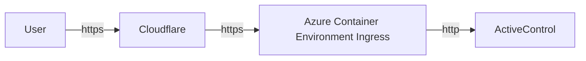
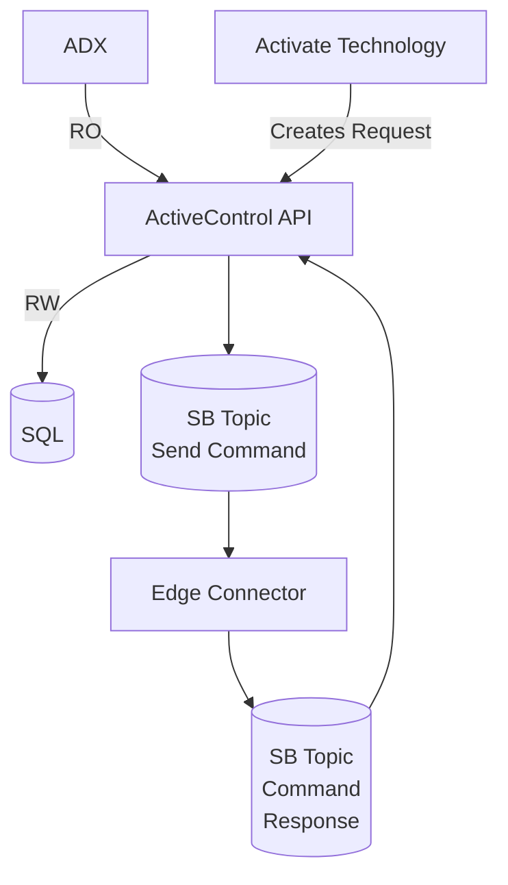

# Threat Model

Key
---
* :recycle: Out-of-scope, someone else at Willow owns this
* :white_check_mark: Risks are low and/or adequately mitigated
* :purple_heart: Improvements are possible
* :fire: Danger

The ActiveControl threat model is based on STRIDE: Spoofing, Tampering, Repudiation, Information Disclosure, Denial Of Service, Elevation of Privilege.

User access is by the web only and all traffic is routed thus:

Data Flow Diagram
====

----
Development
====

|STRIDE | Discussion
|----|----|
|Spoofing | Low risk, Azure DevOps and GitHub repository policies are in place. :white_check_mark:
|Tampering | Developer could introduce malicious code. Mitigated by ... PR process. Developers should not have write access to ADX production systems. :recycle:
| Repudiation | Git history and PR process. :white_check_mark:
| Information Disclosure | No need for production data access during development. Commands can be created locally and executed using the lab equipment. :white_check_mark:
| Denial of service | N/A :white_check_mark:
| Elevation of privilege | DevOps controls. :recycle:

> __Note__ We should develop DDK as a test environment too so developers have no access to production data.

----
Build process
====
| STRIDE | Discussion
|----|----|
| Spoofing | N/A
| Tampering | Bad base image from container repository, Malicious NPM package. DevOps pipeline responsibility to enforce required source checks. :recycle:
| Repudiation | DevOps logs :recycle:<mark>
| Information Disclosure | N/A :white_check_mark:
| Denial of service | N/A :white_check_mark:
| Elevation of privilege | Someone edits the YAML file outside the PR process. Prevented by roles and CODEOWNERS in GitHub. :recycle:

----
Deployment process
====
Platform Team owns this issue. Must ensure containers come from trusted sources, authentication and authorization for deployment admins etc. This merits a separate review. :recycle: :fire:.

| STRIDE | Discussion
|----|----|
| Spoofing | Low risk, GitHub groups and roles used to control deployment authorisation.
| Tampering | Bad image from the container repository. :recycle:
| Repudiation | GitHub Actions logs :recycle:<mark>
| Information Disclosure | N/A :white_check_mark:
| Denial of service | N/A :white_check_mark:
| Elevation of privilege | Someone edits the YAML file outside the PR process. Prevented by roles and CODEOWNERS in GitHub. :recycle:

----
Authentication
====
ADB2C provides all authentication using MSAL libraries. All API calls are checked, 401 errors cause an immediate redirect to the login page. We rely on MSAL for all anti-tampering measures. We do check the JWT Token Authority and Scopes. We rely on ADB2C and AD for any logging of authentication activities. Code review recommended for how MSAL is used and configured. :white_check_mark:

> __Note__ Code review recommended for how MSAL is used and configured.

----
User Management
====
Azure Portal Active Directory is used for User Management including Group/List membership. Low risk. :white_check_mark:

----
Authorization
====
ActiveControl uses DOTNETCORE policy based access control. Implementation of the policies is handled by User Management. Default assignments of permissions to roles is handled.  :white_check_mark:

| STRIDE | Discussion
|----|----|
| Spoofing | All policies are checked on back-end. :white_check_mark:
| Tampering | On the front-end, the disabled button or hidden controls could be tampered with but achieves nothing as back-end controls authorization. :white_check_mark:
| Repudiation | We rely on AppInsights logging. :white_check_mark:
| Information disclosure | Auth failures are reported to the web UI but only minimal details are supplied as to how to address, e.g. "Contact your admin for access to this feature". Needs to be verified. :white_check_mark:
| Denial of service | N/A - policy decisions are implemented in code taking microseconds to evaluate, AD groups are cached for five minutes which rate limits that. :white_check_mark:
| Elevation of privilege | Roles and permissions are provided by User Management. :recycle: 
Default assignments of permissions to roles are stored by the app in settings and sent to User Management. Tampering during development / deployment would be required to modify these. :white_check_mark:

Endpoint Methods
--
| STRIDE | Discussion
|----|----|
| Spoofing | ASPNETCORE checks the Authorize header token on all requests. A valid JWT from a recognized Issuer/Authority must be present. :white_check_mark:
| Tampering | All endpoint methods are protected with Authorize attributes except app configuration. :white_check_mark:
| Repudiation | AppInsights logging . :white_check_mark:
| Information Disclosure | Exception details should not be reported with 500 errors in production. :purple_heart:
| Denial of service | Protection provided by Cloudflare. :recycle:

> __Note__ Check that detailed exceptions are not shown in production browser logs or UI

---
ActiveControl Web App
====
| STRIDE | Discussion
|----|----|
| Spoofing | Any user with approve/execute rights can approve and execute any command. :white_check_mark:
| Tampering | Any user with approve/execute rights can approve and execute any command. All inputs use standard react components that _should_ protect against script injection. :white_check_mark:
| Repudiation | User actions are logged using the standard audit logging process to AppInsights. User actions are separaetly logged to the app database for display within the app. :white_check_mark:
| Information disclosure | User has acces to view all requests, commands and activity logs, so no risk of disclosing information to which they should not have access. This may change in the future. :white_check_mark:
| Denial of service | Protection provided by Cloudflare. :recycle:
| Elevation of privilege | Low risk, ActiveControl runs under Managed Identity. See authentication and authorization for user privilege discussion. :white_check_mark:

----
Edge Connector
====
| STRIDE | Discussion
|----|----|
| Spoofing | Low risk, the edge connector only sends success / failure notifications. :white_check_mark:
| Tampering | Low risk. Service Bus messages are not signed, but access to the topic is Azure RBAC. :white_check_mark:
| Repudiation | N/A, Service Bus logging may include some details :white_check_mark:
| Information disclosure | Low risk, Service bus messages are low-information content. :white_check_mark:
| Denial of service | Low risk, the edge connector processes messages sequentially, and is unlikely to overload the customer network. :purple_heart:
| Elevation of privilege | Low risk, runs as a container in the Edge Runtime on either a Trustbox or customer-managed VM. :white_check_mark:

----
Logging
====
| STRIDE | Discussion
|----|----|
| Spoofing | App Insights permissions. Deployment issue. :white_check_mark:
| Tampering | App Insights permissions. Deployment issue. :white_check_mark:
| Repudiation | App Insights permissions. Deployment issue. :white_check_mark:
| Information Disclosure | We may be logging more than we should in terms of user identity but we have no PII beyond email and name. What are log retention policies and who has access to them? Dev Ops issue. :purple_heart:
| Denial of service | Unlikely, App Insights throttles logging. A user could cause that by making a lot of web requests, we need to protect against that with rate limiting probably at a higher level than here. :white_check_mark:
| Elevation of privilege | N/A :white_check_mark:

> __Note__ Check we aren't logging PII or retaining it for too long.

----
SQL Database
====
Deployment limits database access to the Managed Identity of the container app. The current implementation updates the database schema from within the app, requiring the app to have the `db_owner` role. :purple_heart: :fire:

Entity Framework Core is used for all data access giving good protection against SQL injection. :white_check_mark:

ADX
====
Data reader only access secured by Azure Managed Identity. :recycle: 
