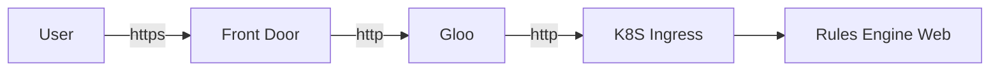
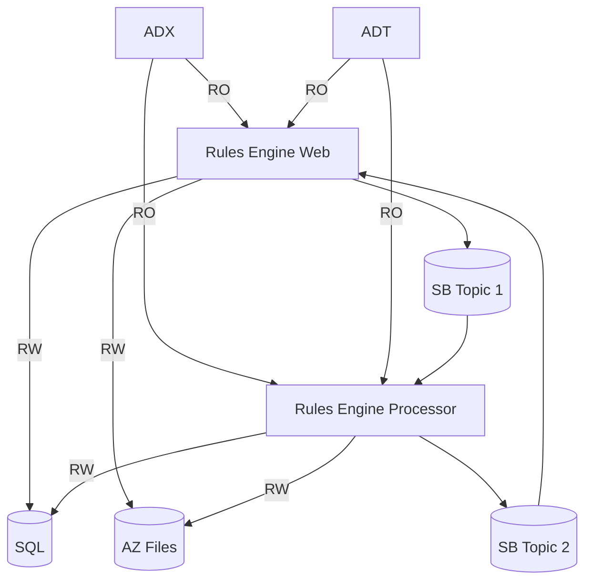

# Threat Model

KEY	
---
* :recycle: out of scope, someone else at Willow owns this
* :white_check_mark: I think we are in good shape here	
* :purple_heart: we could improve
* :fire: danger

The Rules Engine threat model is based on STRIDE: Spoofing, Tampering, Repudiation, Information Disclosure, Denial Of Service, Elevation of Privilege.

User access is by the web only and all traffic is routed thus:

Data Flow Diagram
====

----	
Development
====

|STRIDE | Discussion
|----|----|
|Spoofing | Low risk, Azure Dev Ops and repository policies are in place. :white_check_mark:
|Tampering | Developer could introduce malicious code. Mitigated by ... PR process. Developers should not have write access to ADT or ADX production systems. :recycle:
| Repudiation | Git history? No force-push to main. :white_check_mark:
| Information Disclosure | Developers should _eventually_ have no access to production data, but we are a long way from that and have no synthetic data to test against. :recycle: :fire:
| Denial of service | N/A :white_check_mark:
| Elevation of priviledge | DevOps controls. :recycle:

> __Note__ We should develop DDK as a test environment too so developers have no access to production data.

----
Build process
====
| STRIDE | Discussion
|----|----|
| Spoofing | N/A
| Tampering | Bad base image from container repository, Malicious NPM package. Devops pipeline responsibility to enforce required source checks. :recycle:
| Repudiation | DevOps logs :recycle:<mark>
| Information Disclosure | N/A :white_check_mark:
| Denial of service | N/A :white_check_mark:
| Elevation of priviledge | Someone edits the YAML file outside the PR process. Prevented by devops roles and CODEOWNERS in github. :recycle:
	
----
Deployment process
====
Platform Team owns this issue. Must ensure containers come from trusted sources, authentication and authorization for deployment admins etc. This merits a separate review. :recycle: :fire:.	

----	
Authentication
====
ADB2C provides all authentication using MSAL libraries. All API calls are checked, 401 errors cause an immediate redirect to the login page. We rely on MSAL for all anti-tampering measures. We do check the JWT Token Authority and Scopes. We rely on ADB2C and AD for any logging of authentication activities. Code review recommended for how MSAL is used and configured. :white_check_mark:

> __Note__ Code review recommended for how MSAL is used and configured.

----
User Management
====
Azure Portal Active Directory is used for User Management including Group/List membership. Low risk. :white_check_mark:

----	
Authorization
====
Rules Engine uses DOTNETCORE policy based access control. Each policy is written in easy-to-verify, linear, imperative C# code. All authorization policies should be code reviewed as part of PR process. :white_check_mark:

| STRIDE | Discussion
|----|----|
| Spoofing | All policies are checked on back-end. :white_check_mark:
| Tampering | On the front-end, the disabled button or hidden controls could be tampered with but achieves nothing as back-end controls authorization. :white_check_mark:
| Repudiation | We rely on AppInsights logging. :white_check_mark:
| Information disclosure | Auth failures are reported to the web UI but only minimal details are supplied as to how to address, e.g. "Contact your admin for access to this feature". Needs to be verified. :white_check_mark:
| Denial of service | N/A - policy decisions are implemented in code taking microseconds to evaluate, AD groups are cached for five minutes which rate limits that. :white_check_mark:
| Elevation of priviledge | Policies are hard-coded in C#; list/group memberships are managed by ADB2C AD. Bypassing the front-end code gains nothing as back-end protects every method relying only on the Auth token from the browser. The risk that a user can elevate themselves from read-only to writer or admin -level permissions is low. :white_check_mark:

Controller Methods
--
| STRIDE | Discussion
|----|----|
| Spoofing | ASPNETCORE checks the Authorize header token on all requests. A valid JWT from a recognized Issuer/Authority must be present. :white_check_mark:
| Tampering | All controller methods are protected with Authorize atttributes except those associated with logging in and file upload. :white_check_mark:
| Repudiation | We rely on AppInsights logging. :white_check_mark:
| Information Disclosure | Exception details should not be reported with 500 errors in production. :purple_heart:
| Denial of service | Protection should be at the Front Door / Firewall rules level. Rules Engine only rate limits a few requests to mitigate this. If the user has rights they can spam cache refilling and rule regeneration. :recycle:

> __Note__ Check that detailed exceptions are not shown in production browser logs or UI

File Upload
----
| STRIDE | Discussion
|----|----|
| Spoofing | File Upload is protected by a separate single-use token requested by a secured API. :white_check_mark:
| Tampering | We could do more to check file uploads. Currently if they JSON Parse into the right class they are accepted. Upload 10,000 parameters and it will succeed but cause problems later. :purple_heart:
| Repudiation | We rely on AppInsights logging. :white_check_mark:
| Information disclosure | Files remain in temporary directory on pod. Low risk in terms of useful information. Low risk in terms of access. :white_check_mark:
| Denial of service | No limits on upload size or frequency currently beyond those provided by ASPNET Core. Bad uploads could cause exceptions to trigger and be logged. :purple_heart:
| Elevation of priviledge | The file upload is not rendered in the browser, it is parsed into JSON and the displayed as react components. We need to double-check that the JSON view is rendered safely. :fire: (TODO)

> __Note__ Add checks on upload size and frequency of uploading to prevent denial of service.

---
Rules Web App
====
| STRIDE | Discussion
|----|----|
| Spoofing | Any user with edit rights can edit any rule. :white_check_mark:
| Tampering | Any user with edit rights can edit any rule. All inputs use standard react components that _should_ protect against script injection. :white_check_mark:
| Repudiation | We do not audit rule edits today, there is a log in app insights that could be used to determine who did what. :purple_heart:
| Information disclosure | User has acces to view all rules, models. twins, and insights, so no risk of disclosing information to which they should not have access. This may change in the future. :white_check_mark:
| Denial of service | Protection should be at the Front Door / Firewall rules level. Rules Engine only rate limits a few requests to mitigate this. If the user has rights they can spam cache refilling and rule regeneration. :recycle:
| Elevation of priviledge | Low risk, rules Engine runs under Pod Identity. See authentication and authorization for user priviledge discussion. :white_check_mark:

> __Note__ Need to add logging for who did what for repudiation.

----
Rules Processor
====
| STRIDE | Discussion
|----|----|
| Spoofing | Rules Engine only listens to service bus messages on one specific topic and that topic and subscription is configured by the Twin Platform deployer. No other app should be given any permission to the service bus topics that rules engine uses. Ideally these would be randomly assigned a suffix by the deployment process to help guarantee that. :white_check_mark:
| Tampering | Same :white_check_mark:
| Repudiation | N/A, Service Bus logging may include some details :white_check_mark:
| Information disclosure | Low risk: Service bus messages are low-information content.:white_check_mark: Actor state is persisted to disk but is not encrypted in any way. :white_check_mark:
| Denial of service | ADT caching, Rule Generation and Rule Execution currently run only one at once. Rule execution is not blocked by caching. Repeated requests could tie the system up for hours. :purple_heart:
| Elevation of priviledge | Low risk, rules Engine runs under Pod Identity. :white_check_mark:
    
----
Logging
====
| STRIDE | Discussion
|----|----|
| Spoofing | App Insights permissions. Deployment issue. :white_check_mark:
| Tampering | App Insights permissions. Deployment issue. :white_check_mark:
| Repudiation | App Insights permissions. Deployment issue. :white_check_mark:
| Information Disclosure | We may be logging more than we should in terms of user identity but we have no PII beyond email and name. What are log retention policies and who has access to them? Dev Ops issue. :purple_heart:
| Denial of service | Unlikely, App Insights throttles logging. A user could cause that by making a lot of web requests, we need to protect against that with rate limiting probably at a higher level than here. :white_check_mark:
| Elevation of priviledge | N/A :white_check_mark:

> __Note__ Check we aren't logging PII or retaining it for too long.

----	
SQL Database
====
Deployment limits database access to the Pod. ideally there would be a contained-user and no other extension would have access to the database.	Pod-level database security issue? :recycle:
Entity Framework Core is used for nearly all data access giving good protection against SQL injection. For other SQL queries, SQL parameters are used exclusively and no string concatenation is used. :white_check_mark:

	
Azure Digital Twin
====
Pod identity secures access to ADT and only Data Reader access is provisioned currently. Each customer environment has access only to the ADT instances that it is allowed to read.	Each rules engine instance only has access to the ADT instances for a single customer environment. :white_check_mark:

ADX
====
Data reader only access secured by pod identity. :recycle: 
