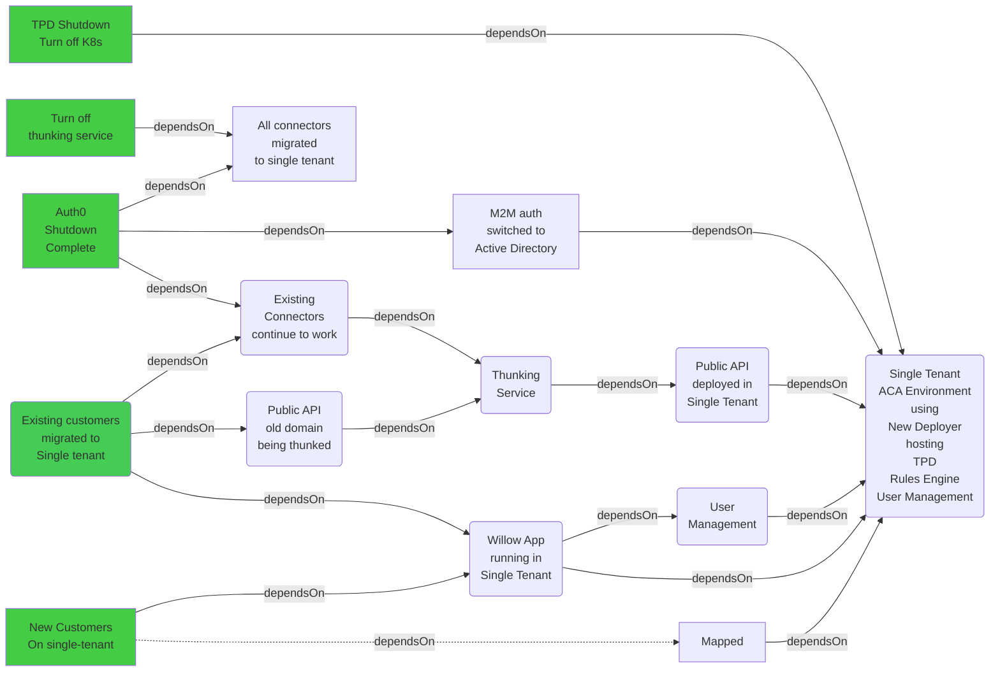

### Single-Tenant Migration

This diagram attempts to make clear the goals (green) and their dependencies on various steps we need to complete the move to Single Tenant.

Along the way we also want to move off Kubernetes and Twin Platform Deployer (TPD) and to complete the deprecation of Auth0 that was started several years ago but never completed.

