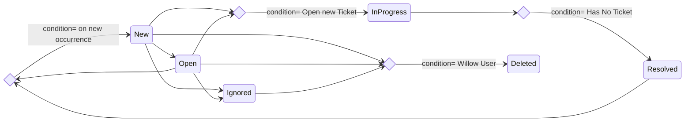

# Insight States Diagrams


Edit the diagram using [Mermaid State Diagram](https://mermaid.js.org/syntax/stateDiagram.html)

# sample-api

## How to run it locally
* Make sure Docker has been installed and running
* Run the command to start a SQL server container
```cmd
docker run -d --rm --name test-mssql -e "ACCEPT_EULA=Y" -e "SA_PASSWORD=Password01!" -p 61234:1433 mcr.microsoft.com/mssql/server:2017-latest
```
* Start the service
```
dotnet run
```
* Verify the service is running. Open your favorite browser and navigate to these two links
```
https://localhost:5001/swagger
https://localhost:5001/healthcheck
```


## Database related test cases

* If using EF core, the sample code below leverages EF in-memory database to run test cases quickly.

``` csharp
public class GetSchoolsTests : BaseInMemoryTest
{
    public GetSchoolsTests(ITestOutputHelper output) : base(output)
    {
    }

    [Fact]
    public async Task ThereAreSomeSchools_GetSchools_ReturnsThoseSchools()
    {
        using (var server = CreateServerFixture(ServerFixtureConfigurations.InMemoryDb))
        using (var client = server.CreateClient())
        {
            ...
        }
    }
}
```

* If using EF core and still want to run test cases on real SQL database, add the below environment variable before running test cases.

```
set TEST_UseInMemoryDatabase=False
```

* If not using EF core, the sample test code below will be run on real SQL server (container).

``` csharp
public class SchoolsDataSeedTests : BaseDbTest
{
    public SchoolsDataSeedTests(ITestOutputHelper output) : base(output)
    {
    }

    [Trait("Category", "UseSqlServer")]
    [Fact]
    public async Task AfterInitialization_GetSchools_ReturnsThreeBuiltInSchools()
    {
        using (var server = CreateServerFixture(ServerFixtureConfigurations.SqlServer))
        using (var client = server.CreateClient())
        {
            ...
        }
    }
}
```


# Build Docker
Building docker image requires a AzureDevops pat token with permission to read artifact feeds

```powershell
docker build --build-arg FEED_ACCESSTOKEN=$env:FEED_ACCESSTOKEN -t insightcore:latest -f .\src\InsightCore\Dockerfile .
```
